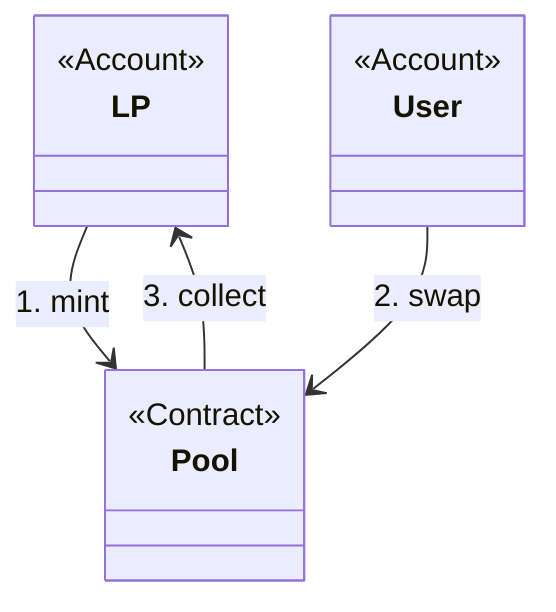
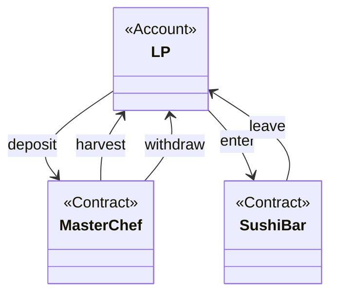
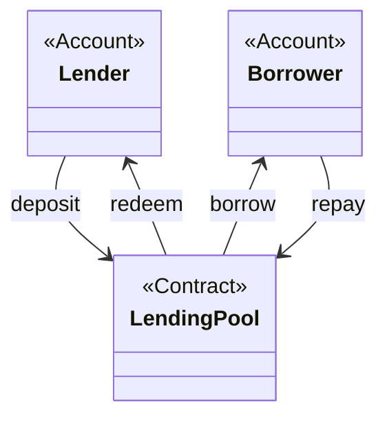
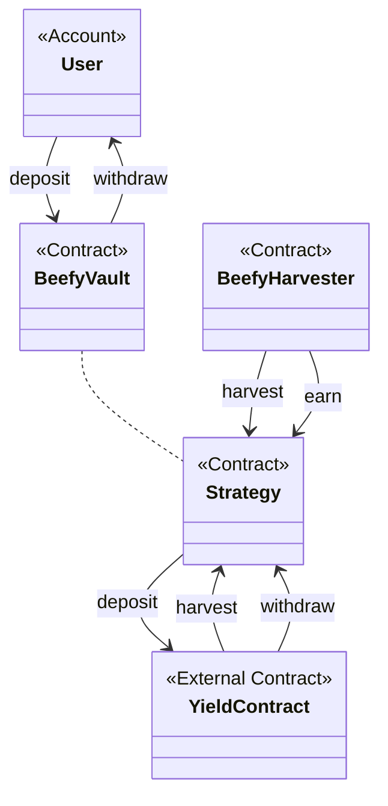
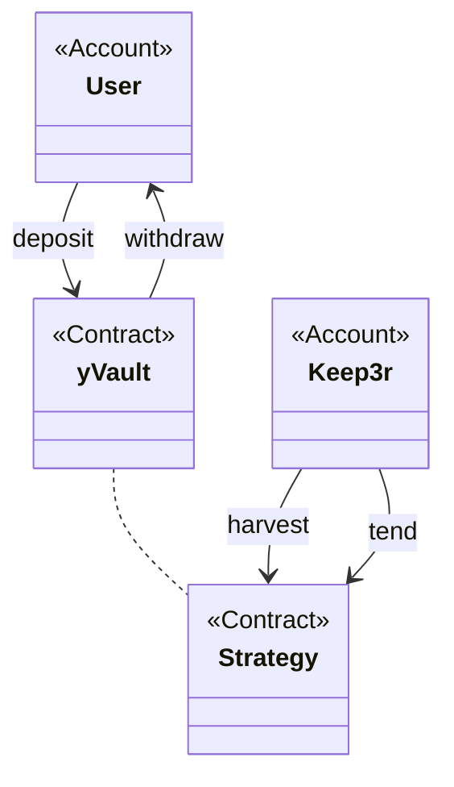

# DeFi (Decentralized Finance)

## Provide Liquidity
 
Automated Market Making (AMM) Decentralized Exchange (DEX)

It allows Liquidity Providers (LP) to deposit token pairs into Liquidity Pool

Users can swap tokens in Pool, and the fees are distributed between LPs

Each Pool is minting its own Token for LPs representing their stake

Uniswap V2 is original implementation of Constant Product Pool (CPP), it always keeps the equal value of both tokens in the pool, and liquidity is distributed linearly in the whole price range

Uniswap V3 has implementation of Concentrated Liquidity Pool, it allows LPs to choose price range and receive higher ROI while price staying in the range

G-UNI has solution to manage Uniswap V3 positions automatically readjusting price range and compounding rewards

Trident Framework provides building blocks for the future AMM DEXes with unified interface

## Farming yield

SushiSwap has AMM DEX forked from Uniswap V2

MasterChef contract is original implementation of Yield Farming by SushiSwap

LP tokens received from UniswapV2 can be staked into MasterChef

100 SUSHI per block are minted by MasterChef, these tokens can be claimed by users who staked their LP tokens, the amount is proportional to their stake multiplied by weight assigned to each pool

SUSHI can be converted into xSUSHI, and xSUSHI holders can claim 0.05% fee from all trades on SushiSwap AMM

There are other Yield Farms forked from MasterChef incentivizing users to stake their LPs and receive Farm tokens, those Farm tokens often loose value quickly unless protocol provides solid incentive such as using trading fees to buy them

Also beware of Deposit and Withdraw fees might be exciding the expected profit

In this diagram, (1) user deposit LP tokens, then (2) can harvest SUSHI, then (3) can withdraw his LP tokens, then (4) can enter bar to deposit SUSHI and receive xSUSHI, then (5) can leave bar to burn xSUSHI and claim increased amount of SUSHI 

## Lending tokens

Aave, Compound, and other protocols allow to lend/borrow tokens

User can provide tokens to the protocol and earn Annual Percentage Rate (APR)

Collateral tokens can be deposited to borrow other tokens

Collateral Debt Position (CDP) are liquidated once Loan To Value (LTV) is reached

The same tokens which are borrowed can be deposited for lending again, so to leverage increased yield on price appreciation (looping)

## Vaults

Vault contract is created for token pair and composed with yield strategy for it

Users can deposit tokens into Vault and receive Vault Token representing their stake

Vault is investing deposited tokens accordingly to the strategy: provide liquidity, lending, yield farming, and can even combine and synergize multiple methods

Vault withdraws earnings periodically for compounding reinvesting back again

Auto compounding effect makes noticable difference of Annual Percentage Yield (APY) higher than APR

Keeper networks are executing transactions to Vault batching operations for multiple users to optimize gas

## beefy.finance

User can deposit tokens into Beefy Vault, then BeefyVault deposits into Strategy, which in turn deposits into external yield-yearning contract, increasing shares supply

When user withdraws from Beefy Vault, it asks Strategy to withdraw from yield contract and transfer back to user increased amount of tokens, burning his shares

Harvest is executed directly on Strategy, which in turn executes harvest on underlying yield contract, and then executes deposit on the yield contract reinvesting profits again

BeefyHarvester executes the role of the Keeper batching harvest transactions for all Vaults

The supported strategies include yield farming and lending

The Vaults are deployed on all EVM chains

## yearn.finance

yVault supports multiple yield strategies at the same time, it does distribute deposited tokens between them in order of the highest APY but respecting their limits

Some strategies are more sophisticated, performing operations between multiple protocols in the same transaction, i.e. borrowing more assets for yield farming, - that makes it more profitable and risky

Harvest and earn transactions are executed automatically by Keep3r network

The Vaults are deployed on Ethereum and Fantom chains

Also, it does distribute additional rewards from earning on curve.fi

